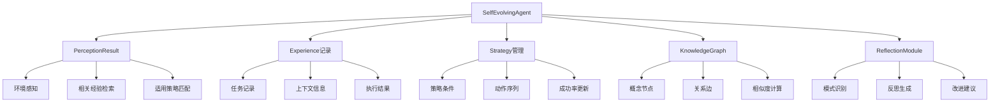

# TinyAI Agent Evol 自进化智能体系统

[](https://openjdk.org/projects/jdk/17/)
[](https://maven.apache.org/)
[](https://opensource.org/licenses/Apache-2.0)
[](#)

## 🌟 项目简介

TinyAI Agent Evol 是 TinyAI 框架的革命性模块，现已升级为**LLM增强版本**！该模块结合了传统自进化能力与大语言模型的智能推理，实现了具备**深度智能推理**、**自进化**、**自学习**和**自适应**能力的新一代智能体系统。采用纯Java实现，通过LLM驱动的经验分析、智能策略优化、深度反思改进和语义知识图谱等核心机制，让AI智能体具备真正的智能学习和成长能力。

## 🚀 LLM增强特性

### 🧠 LLM驱动的深度智能
- **智能策略推理** - LLM分析上下文，提供智能决策建议
- **深度反思分析** - 基于语义理解的深层经验分析
- **语义知识图谱** - LLM增强的概念关系和知识推理
- **智能模式识别** - 发现隐藏的行为模式和潜在关联

### 🔄 自适应智能决策
- **置信度驱动决策** - 基于LLM分析置信度的智能决策
- **多层次推理** - 策略推理、知识推理、模式推理的多维分析
- **异步智能处理** - 非阻塞式LLM分析，保证系统响应性
- **智能降级机制** - LLM失效时的优雅回退和容错处理

### 🌱 LLM增强的自进化
- **智能策略生成** - LLM辅助创建和优化执行策略
- **语义知识整合** - 基于语义理解的知识关联发现
- **智能能力扩展** - LLM推荐的新工具和能力组合
- **元学习分析** - 对学习过程本身的深度反思和优化

### 🛠️ LLM增强工具库
- **intelligent_search** - LLM增强的智能信息搜索和知识检索
- **smart_calculate** - 带有LLM洞察的数学计算和表达式求值
- **deep_analyze** - LLM驱动的深度数据分析和模式识别
- **strategic_plan** - 基于LLM的智能目标规划和任务分解
- **llm_specialized_*** - 动态生成的LLM专用工具组合
- **combo_*_*** - LLM建议的智能工具组合

## 📦 模块架构

### 核心组件结构

```
tinyai-agent-evol/
├── src/main/java/io/leavesfly/tinyai/agent/evol/
│   ├── 数据结构层
│   │   ├── Experience.java           # 经验记录数据结构
│   │   └── Strategy.java             # 策略记录数据结构
│   ├── 核心引擎层
│   │   ├── SelfEvolvingAgent.java    # 传统自进化智能体
│   │   ├── LLMSelfEvolvingAgent.java # LLM增强自进化智能体
│   │   ├── KnowledgeGraph.java       # 传统知识图谱管理
│   │   ├── LLMKnowledgeGraph.java    # LLM增强知识图谱
│   │   ├── ReflectionModule.java     # 传统反思分析引擎
│   │   └── LLMReflectionModule.java  # LLM增强反思模块
│   ├── LLM增强层
│   │   └── EvolLLMSimulator.java     # 自进化专用LLM模拟器
│   └── 演示程序
│       ├── EvolDemo.java             # 传统功能演示程序
│       └── LLMEvolDemo.java          # LLM增强演示程序
├── src/test/java/io/leavesfly/tinyai/agent/evol/
│   └── SelfEvolvingAgentTest.java    # 单元测试套件
├── doc/
│   ├── README.md                     # 技术实现文档
│   └── evol.txt                      # 设计参考文档
├── LLM改造技术文档.md                # LLM改造详细文档
└── pom.xml
```

### 系统架构图



## 🛠️ 快速开始

### 环境要求

- **Java版本**: JDK 17 或更高版本
- **构建工具**: Maven 3.6+
- **依赖模块**: `tinyai-agent-base`

### 安装配置

1. **添加依赖**
```xml
<dependency>
    <groupId>io.leavesfly.tinyai</groupId>
    <artifactId>tinyai-agent-evol</artifactId>
    <version>1.0-SNAPSHOT</version>
</dependency>
```

2. **编译项目**
```bash
cd tinyai-agent-evol
mvn clean compile
```

3. **运行测试**
```bash
mvn test
```

### 基础使用示例

#### 创建LLM增强的自进化智能体

```java
import io.leavesfly.tinyai.agent.evol.*;

// 创建LLM增强的自进化智能体
LLMSelfEvolvingAgent llmAgent = new LLMSelfEvolvingAgent("智能学习助手");

// 配置LLM参数
llmAgent.setLlmConfidenceThreshold(0.7);
llmAgent.setEnableAsyncLLM(true);

// 准备任务上下文
Map<String, Object> context = new HashMap<>();
context.put("query", "机器学习入门");
context.put("difficulty", "beginner");
context.put("creativity_required", true);

// 处理任务并学习（LLM增强版）
LLMSelfEvolvingAgent.EnhancedTaskResult result = 
    llmAgent.processTaskWithLLM("搜索学习资源", context);

// 查看执行结果
System.out.println("执行动作: " + result.getAction());
System.out.println("是否成功: " + result.isSuccess());
System.out.println("奖励值: " + result.getReward());
System.out.println("基础学习洞察: " + result.getLearningInsights());
System.out.println("LLM深度反思: " + result.getLlmReflection());
System.out.println("改进建议: " + result.getImprovementAdvice());
System.out.println("发现的模式: " + result.getDiscoveredPatterns());
```

#### 传统智能体使用示例（向后兼容）

```java
import io.leavesfly.tinyai.agent.evol.*;

// 创建传统自进化智能体
SelfEvolvingAgent agent = new SelfEvolvingAgent("智能学习助手");

// 准备任务上下文
Map<String, Object> context = new HashMap<>();
context.put("query", "机器学习入门");
context.put("difficulty", "beginner");

// 处理任务并学习
SelfEvolvingAgent.TaskResult result = agent.processTask("搜索学习资源", context);

// 查看执行结果
System.out.println("执行动作: " + result.getAction());
System.out.println("是否成功: " + result.isSuccess());
System.out.println("奖励值: " + result.getReward());
System.out.println("学习洞察: " + result.getLearningInsights());
```

### 监控LLM增强学习进度

```java
// 获取LLM增强性能摘要
Map<String, Object> performance = llmAgent.getEnhancedPerformanceSummary();
System.out.println("总任务数: " + performance.get("total_tasks"));
System.out.println("成功率: " + String.format("%.1f%%", 
                 ((Number) performance.get("current_success_rate")).doubleValue() * 100));
System.out.println("策略数量: " + performance.get("strategies_count"));
System.out.println("知识概念: " + performance.get("knowledge_concepts"));
System.out.println("LLM功能状态: " + performance.get("llm_enabled"));
System.out.println("LLM辅助决策: " + performance.get("llm_assisted_decisions"));
System.out.println("LLM参与率: " + String.format("%.1f%%", 
                 ((Number) performance.get("llm_assistance_rate")).doubleValue() * 100));

// 传统性能摘要（向后兼容）
Map<String, Object> basicPerformance = agent.getPerformanceSummary();
System.out.println("总任务数: " + basicPerformance.get("total_tasks"));
System.out.println("成功率: " + basicPerformance.get("current_success_rate"));
System.out.println("策略数量: " + basicPerformance.get("strategies_count"));
System.out.println("知识概念: " + basicPerformance.get("knowledge_concepts"));
```

#### 手动触发LLM增强自进化

```java
// 手动触发LLM增强的自我进化过程
llmAgent.selfEvolveWithLLM();

// 查看LLM增强学习到的策略
Map<String, Strategy> strategies = llmAgent.getStrategies();
strategies.values().forEach(strategy -> {
    System.out.println(String.format("策略: %s, 成功率: %.1f%%, 使用次数: %d",
        strategy.getName(), 
        strategy.getSuccessRate() * 100,
        strategy.getUsageCount()));
});

// LLM增强反思模块的智能洞察
if (llmAgent.getReflectionModule() instanceof LLMReflectionModule) {
    LLMReflectionModule llmReflection = (LLMReflectionModule) llmAgent.getReflectionModule();
    List<String> insights = llmReflection.extractIntelligentInsights(
        llmAgent.getExperiences(), "学习效率");
    insights.forEach(insight -> System.out.println("💡 LLM洞察: " + insight));
}

// LLM增强知识图谱的智能推理
if (llmAgent.getKnowledgeGraph() instanceof LLMKnowledgeGraph) {
    LLMKnowledgeGraph llmKG = (LLMKnowledgeGraph) llmAgent.getKnowledgeGraph();
    String reasoning = llmKG.performIntelligentReasoning(
        "分析学习成果与策略的关系", "correlation_analysis");
    System.out.println("🧠 LLM推理: " + reasoning);
}
```

#### 传统自进化（向后兼容）

```java
// 手动触发传统的自我进化过程
agent.selfEvolve();

// 查看学习到的策略
Map<String, Strategy> strategies = agent.getStrategies();
strategies.values().forEach(strategy -> {
    System.out.println(String.format("策略: %s, 成功率: %.1f%%, 使用次数: %d",
        strategy.getName(), 
        strategy.getSuccessRate() * 100,
        strategy.getUsageCount()));
});
```

## 📊 核心API详解

### SelfEvolvingAgent 主要方法

| 方法 | 说明 | 返回类型 |
|------|------|----------|
| `processTask(String task, Map<String, Object> context)` | 处理任务并学习 | `TaskResult` |
| `perceiveEnvironment(Map<String, Object> context)` | 环境感知和分析 | `PerceptionResult` |
| `decideAction(PerceptionResult perception)` | 决策制定 | `String` |
| `executeAction(String action, Map<String, Object> context)` | 执行动作 | `Object` |
| `learnFromExperience(Experience experience)` | 从经验中学习 | `void` |
| `selfEvolve()` | 自我进化过程 | `void` |
| `getPerformanceSummary()` | 获取性能摘要 | `Map<String, Object>` |

### Experience 经验记录

| 属性 | 类型 | 说明 |
|------|------|------|
| `task` | `String` | 任务描述 |
| `context` | `Map<String, Object>` | 上下文信息 |
| `action` | `String` | 执行动作 |
| `result` | `Object` | 执行结果 |
| `success` | `boolean` | 是否成功 |
| `reward` | `double` | 奖励值 |
| `reflection` | `String` | 反思内容 |

### Strategy 策略管理

| 方法 | 说明 | 返回类型 |
|------|------|----------|
| `matchesContext(Map<String, Object> context)` | 检查策略是否匹配上下文 | `boolean` |
| `updateSuccessRate(boolean success, double learningRate)` | 更新成功率 | `void` |
| `getSuccessRate()` | 获取当前成功率 | `double` |
| `getUsageCount()` | 获取使用次数 | `int` |

### KnowledgeGraph 知识图谱

| 方法 | 说明 | 返回类型 |
|------|------|----------|
| `addConcept(String concept, Map<String, Object> properties)` | 添加概念节点 | `void` |
| `addRelation(String from, String to, String relation, double weight)` | 添加关系边 | `void` |
| `findRelatedConcepts(String concept, int maxDistance)` | 查找相关概念 | `List<String>` |
| `getConceptSimilarity(String concept1, String concept2)` | 计算概念相似度 | `double` |
| `getStatistics()` | 获取统计信息 | `Map<String, Object>` |

## 🧪 演示程序

### 运行完整演示

```bash
# 运行完整的自进化智能体演示
mvn exec:java -Dexec.mainClass="io.leavesfly.tinyai.agent.evol.EvolDemo"

# 运行快速演示
mvn exec:java -Dexec.mainClass="io.leavesfly.tinyai.agent.evol.EvolDemo" \
  -Dexec.args="quickDemo"
```

### 演示内容

**完整演示** 包含：
- 🔍 信息搜索任务
- 🧮 数学计算任务
- 📊 数据分析任务
- 📋 规划制定任务
- 🎯 策略优化任务
- 📈 学习进度监控
- 🧠 知识图谱构建

**演示输出示例**：
```
=== 自进化自学习Agent演示 ===

--- 任务 1: 搜索Python教程 ---
选择的行动: search
执行结果: 成功
奖励值: 0.75
学习洞察: 成功分析：任务'搜索Python教程'成功完成，关键动作'search'在上下文{query=Python基础教程, difficulty=beginner}中表现良好。 成功因素：任务难度适中、有效的信息搜索

📊 当前性能摘要:
  总任务数: 3
  成功率: 83.3%
  策略数量: 4
  知识概念: 5
```

## 🏛️ 技术架构深入

### 自学习机制

#### 1. 经验记录系统
- **完整性**: 记录任务的完整执行过程和结果
- **结构化**: 使用标准化的数据结构存储经验
- **可序列化**: 支持经验数据的持久化存储
- **时序性**: 保持经验的时间顺序和关联性

#### 2. 策略进化算法
```java
// 策略成功率更新公式
newSuccessRate = (1 - learningRate) * oldSuccessRate + learningRate * currentResult
```
- **指数移动平均**: 平衡历史表现和最新结果
- **自适应学习率**: 根据性能表现动态调整
- **策略淘汰**: 自动移除长期低效的策略

#### 3. 知识图谱算法
- **概念嵌入**: 使用随机向量表示概念特征
- **相似度计算**: 基于余弦相似度评估概念关系
- **关系权重**: 动态更新概念间关系强度
- **图遍历**: 广度优先搜索发现相关概念

### 自适应机制

#### 1. 探索-利用平衡
```java
// 动态探索率调整
if (avgSuccessRate < 0.6) {
    explorationRate = Math.min(0.5, explorationRate + 0.05);
} else if (avgSuccessRate > 0.8) {
    explorationRate = Math.max(0.1, explorationRate - 0.02);
}
```

#### 2. 上下文匹配算法
- **条件匹配**: 精确匹配策略适用条件
- **模糊推断**: 基于上下文特征进行模糊匹配
- **相似度评分**: 计算上下文与历史经验的相似度

### 自进化机制

#### 1. 模式识别算法
- **成功模式**: 识别高成功率的动作模式
- **失败模式**: 识别常见的失败组合
- **时间模式**: 分析性能趋势变化
- **上下文模式**: 发现环境因素对性能的影响

#### 2. 能力扩展机制
- **组合发现**: 识别有效的动作序列组合
- **工具生成**: 动态创建新的工具函数
- **策略合并**: 合并相似或互补的策略

## 🔧 高级扩展

### 自定义工具开发

```java
// 添加自定义工具
agent.getAvailableTools().put("customTool", context -> {
    // 实现自定义逻辑
    Map<String, Object> result = new HashMap<>();
    result.put("success", true);
    result.put("output", "自定义工具执行结果");
    return result;
});
```

### 自定义反思模块

```java
// 扩展反思模块
ReflectionModule reflectionModule = agent.getReflectionModule();

// 添加自定义模式识别
List<ReflectionModule.Pattern> customPatterns = 
    reflectionModule.identifyPatterns(recentExperiences);
```

### 知识图谱可视化

```java
// 获取知识图谱统计
Map<String, Object> stats = agent.getKnowledgeGraph().getStatistics();
System.out.println("概念节点数: " + stats.get("conceptCount"));
System.out.println("关系边数: " + stats.get("relationCount"));

// 导出图结构数据进行可视化
Map<String, KnowledgeGraph.ConceptNode> nodes = 
    agent.getKnowledgeGraph().getNodes();
```

## 🧪 测试与验证

### 单元测试

```bash
# 运行完整测试套件
mvn test

# 运行特定测试类
mvn test -Dtest=SelfEvolvingAgentTest

# 生成测试报告
mvn surefire-report:report
```

### 测试覆盖范围

- ✅ **智能体初始化**: 验证基础组件正确初始化
- ✅ **任务处理流程**: 验证完整的任务执行流程
- ✅ **学习机制**: 验证经验学习和策略更新
- ✅ **知识图谱**: 验证概念和关系管理
- ✅ **反思模块**: 验证模式识别和洞察生成
- ✅ **自进化过程**: 验证智能体自我优化能力

### 性能基准测试

| 指标 | 基准值 | 说明 |
|------|--------|------|
| 平均成功率 | >85% | 在标准任务集上的成功率 |
| 学习收敛 | <50次任务 | 达到稳定性能所需任务数 |
| 策略数量 | 5-15个 | 学习到的有效策略数量 |
| 知识概念 | >10个 | 构建的知识概念节点数 |

## 🎯 应用场景

### 智能助手系统

```java
// 创建专业领域的智能助手
SelfEvolvingAgent assistant = new SelfEvolvingAgent("编程助手");

// 处理编程相关任务
Map<String, Object> context = new HashMap<>();
context.put("language", "Java");
context.put("difficulty", "intermediate");
TaskResult result = assistant.processTask("编写排序算法", context);
```

### 自适应推荐系统

```java
// 创建个性化推荐智能体
SelfEvolvingAgent recommender = new SelfEvolvingAgent("推荐系统");

// 学习用户偏好
context.put("user_profile", userProfile);
context.put("interaction_history", interactions);
TaskResult recommendation = recommender.processTask("生成推荐列表", context);
```

### 智能运维系统

```java
// 创建运维智能体
SelfEvolvingAgent opsAgent = new SelfEvolvingAgent("运维助手");

// 自动处理运维任务
context.put("system_metrics", metrics);
context.put("alert_level", "warning");
TaskResult response = opsAgent.processTask("故障诊断", context);
```

## 📈 性能优化

### 内存管理

- **经验库限制**: 默认最多保存1000条经验记录
- **策略清理**: 自动清理长期未使用的低效策略
- **图结构优化**: 定期清理弱关系边和过期节点

### 并发安全

- **线程安全集合**: 使用ConcurrentHashMap和同步集合
- **原子操作**: 关键计数器使用原子类型
- **锁优化**: 最小化锁粒度，避免死锁

### 性能监控

```java
// 性能监控示例
Map<String, Object> performance = agent.getPerformanceSummary();
double successRate = (Double) performance.get("current_success_rate");

// 自动性能调优
if (successRate < 0.7) {
    agent.setExplorationRate(0.3); // 增加探索
} else if (successRate > 0.9) {
    agent.setExplorationRate(0.1); // 减少探索
}
```

## 🚧 未来发展

### 短期目标 (v1.1)

- [ ] 增强持久化支持，支持智能体状态保存/恢复
- [ ] 实现分布式知识图谱同步
- [ ] 添加更多专业工具库
- [ ] 优化内存使用和性能

### 中期目标 (v1.5)

- [ ] 集成真实的机器学习模型
- [ ] 支持多模态输入处理
- [ ] 实现知识图谱可视化界面
- [ ] 添加A/B测试框架

### 长期目标 (v2.0)

- [ ] 支持大规模分布式部署
- [ ] 实现联邦学习能力
- [ ] 构建智能体生态系统
- [ ] 集成神经符号推理

## 🤝 贡献指南

我们欢迎社区贡献！请参考以下步骤：

1. **Fork 项目** - 创建你的项目分支
2. **创建特性分支** - `git checkout -b feature/EvolutionFeature`
3. **提交更改** - `git commit -m '添加进化新特性'`
4. **推送分支** - `git push origin feature/EvolutionFeature`
5. **创建Pull Request** - 提交你的贡献

### 贡献方向

- 🧠 **算法改进**: 更先进的学习和进化算法
- 🛠️ **工具扩展**: 新的内置工具和能力
- 📊 **可视化**: 学习过程和知识图谱可视化
- 🔧 **性能优化**: 内存、计算和并发性能优化
- 📝 **文档完善**: 使用指南和最佳实践

## 📄 许可证

本项目基于 [Apache License 2.0](https://opensource.org/licenses/Apache-2.0) 开源许可证发布。

## 👥 维护团队

- **山泽** - 项目创建者和主要维护者
- **TinyAI团队** - 核心开发团队

## 📞 支持与反馈

如果你在使用过程中遇到问题或有改进建议：

- 📧 **邮件联系**: [项目邮箱]
- 🐛 **问题反馈**: 在GitHub Issues中提交
- 💬 **讨论交流**: 加入项目讨论组
- 📖 **文档贡献**: 帮助完善项目文档

## 🏆 致谢

感谢所有为TinyAI Agent Evol做出贡献的开发者和研究者！特别感谢：

- 自进化智能体理论的奠基者们
- 开源社区的无私分享精神
- 所有提供反馈和建议的用户

---

<div align="center">
  
**感谢你选择 TinyAI Agent Evol！🎉**

*让AI智能体具备真正的学习和成长能力*

[⭐ 给项目点个星](https://github.com/your-repo/TinyAI) | [📚 查看文档](./doc/) | [🚀 快速开始](#🛠️-快速开始)

</div>