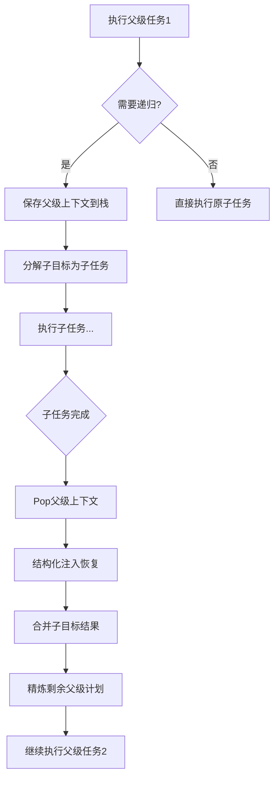
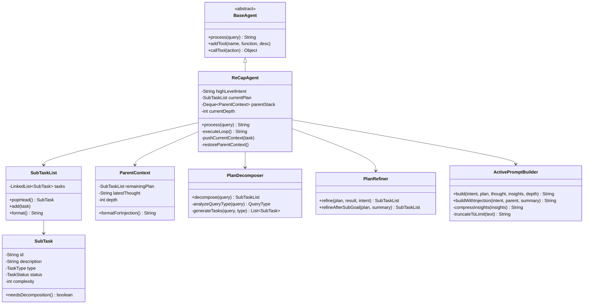

# ReCAP Agent 模式技术方案

> Recursive Context-Aware Reasoning and Planning  
> 递归上下文感知推理与规划

## 📋 目录

- [1. 概述](#1-概述)
- [2. 核心机制](#2-核心机制)
- [3. 架构设计](#3-架构设计)
- [4. 实现详解](#4-实现详解)
- [5. 与ReAct对比](#5-与react对比)
- [6. 使用指南](#6-使用指南)
- [7. 性能分析](#7-性能分析)

---

## 1. 概述

### 1.1 背景

ReCAP (Recursive Context-Aware Reasoning and Planning) 是一个层级式提示框架，专门解决传统Agent模式（如ReAct）在长任务链处理中的局限性：

**传统ReAct的问题**：
- ❌ 上下文无限累积导致膨胀
- ❌ 长任务链中容易丢失高层意图
- ❌ 无法有效分解和管理复杂任务
- ❌ 计划灵活性不足

**ReCAP的解决方案**：
- ✅ 递归层级分解 + 共享上下文
- ✅ 滑动窗口 + 结构化注入保持高层意图
- ✅ 完整任务列表 + 动态精炼计划
- ✅ 活动提示有界，外部状态线性增长

### 1.2 论文来源

- **标题**: ReCAP: Recursive Context-Aware Reasoning and Planning for Large Language Model Agents
- **会议**: NeurIPS 2025
- **作者**: Zhenyu Zhang, Tianyi Chen, Weiran Xu, Alex Pentland, Jiaxin Pei
- **仓库**: https://github.com/ReCAP-Stanford/ReCAP

### 1.3 适用场景

| 场景类型 | ReAct | ReCAP |
|---------|-------|-------|
| 简单工具调用 | ⭐⭐⭐⭐⭐ | ⭐⭐⭐ |
| 复杂任务分解 | ⭐⭐ | ⭐⭐⭐⭐⭐ |
| 长任务链 (10+步) | ⭐⭐ | ⭐⭐⭐⭐⭐ |
| 多层级嵌套任务 | ⭐ | ⭐⭐⭐⭐⭐ |
| 需保持全局一致性 | ⭐⭐ | ⭐⭐⭐⭐⭐ |
| 快速响应 | ⭐⭐⭐⭐⭐ | ⭐⭐⭐ |

---

## 2. 核心机制

ReCAP的三大核心机制确保了长任务链的高效处理：

### 2.1 Plan-ahead Task Decomposition (提前计划分解)

**传统方式 (ReAct)**:
```
每步生成一个行动 → 观察 → 下一步生成一个行动 → ...
问题: 缺乏全局规划，容易偏离目标
```

**ReCAP方式**:
```
一次性生成完整子任务列表:
[任务1, 任务2, 任务3, ...]
        ↓
只执行头部任务 → 观察结果 → 精炼剩余计划
        ↓
继续执行下一个头部任务...
```

**优势**:
- 保持全局意图
- 避免计划漂移
- 支持动态调整

**实现类**: `PlanDecomposer`
```java
// 一次性分解为完整子任务列表
SubTaskList decompose(String query) {
    // 分析查询类型
    QueryType type = analyzeQueryType(query);
    
    // 生成完整任务列表
    List<SubTask> tasks = generateTasks(query, type);
    
    // 标记任务类型 (ATOMIC/COMPOSITE)
    for (SubTask task : tasks) {
        task.setType(determineTaskType(task.getDescription()));
        task.setComplexity(estimateComplexity(task.getDescription()));
    }
    
    return new SubTaskList(tasks);
}
```

### 2.2 Structured Context Re-injection (结构化上下文注入)

**核心思想**: 所有递归深度在**同一个共享LLM上下文**中推理，避免创建多个Agent实例。

**机制流程**:



**关键数据结构**:

```java
// 父级上下文 (栈元素)
public class ParentContext {
    private final SubTaskList remainingPlan;      // 剩余计划
    private final String latestThought;            // 最新思考
    private final int depth;                       // 递归深度
    private final String subGoalDescription;       // 子目标描述
    
    // 用于结构化注入
    public String formatForInjection() {
        return "=== 父级上下文恢复 (深度:" + depth + ") ===\n" +
               "子目标: " + subGoalDescription + "\n" +
               "之前的思考: " + latestThought + "\n" +
               "剩余计划:\n" + remainingPlan.format();
    }
}
```

**恢复机制**:
```java
private void restoreParentContext() {
    ParentContext parent = parentStack.pop();
    currentDepth = parent.getDepth();
    
    // 1. 恢复父级计划
    this.currentPlan = parent.getRemainingPlan();
    
    // 2. 生成子目标摘要
    String childSummary = summarizeChildExecution();
    
    // 3. 合并思考
    this.latestThought = mergeThoughts(
        parent.getLatestThought(), 
        childSummary
    );
    
    // 4. 精炼父级剩余计划
    this.currentPlan = refiner.refineAfterSubGoal(
        currentPlan, 
        childSummary, 
        highLevelIntent
    );
}
```

### 2.3 Memory-efficient Scalability (内存高效的可扩展性)

**问题**: 如何在保持高层意图的同时，避免上下文无限增长？

**解决方案**: 活动提示有界 + 外部状态线性增长

#### 2.3.1 活动提示有界 (Bounded Active Prompt)

```java
public class ActivePromptBuilder {
    private static final int MAX_TOKENS = 4000; // 固定上限
    
    public String build(...) {
        StringBuilder prompt = new StringBuilder();
        
        // 1. 共享Few-shot (只在顶层包含，避免重复)
        if (currentDepth == 0) {
            prompt.append(SHARED_FEW_SHOT);
        }
        
        // 2. 高层意图 (始终保持)
        prompt.append("## 高层目标\n" + highLevelIntent);
        
        // 3. 关键发现 (压缩，只保留最近5条)
        prompt.append(compressInsights(keyInsights));
        
        // 4. 当前计划
        prompt.append(currentPlan.format());
        
        // 5. 最新思考
        prompt.append(latestThought);
        
        // 6. 截断到限制
        return truncateToLimit(prompt.toString());
    }
    
    // 智能截断：保留开头(高层意图)和结尾(当前计划)
    private String truncateToLimit(String text) {
        if (estimateTokens(text) <= MAX_TOKENS) {
            return text;
        }
        
        int headLen = targetChars / 3;
        int tailLen = targetChars * 2 / 3;
        
        return text.substring(0, headLen) + 
               "\n...[已截断]...\n" + 
               text.substring(text.length() - tailLen);
    }
}
```

#### 2.3.2 外部状态线性增长

```java
// 外部状态 (随递归深度线性增长)
private Deque<ParentContext> parentStack;  // O(depth)
private List<String> keyInsights;          // O(n), 压缩后有界
private List<ExecutionResult> results;     // O(n)

// 空间复杂度: O(depth + n)
// 其中 depth ≤ MAX_RECURSION_DEPTH (固定上限)
```

**对比**:

| 特性 | ReAct | ReCAP |
|------|-------|-------|
| 活动提示大小 | O(n) 累积增长 | O(1) 保持有界 |
| 外部状态 | 无需管理 | O(depth + n) 线性 |
| Few-shot重复 | 每次都包含 | 只在顶层包含 |
| 高层意图保持 | ❌ 可能丢失 | ✅ 始终保持 |

---

## 3. 架构设计

### 3.1 整体架构

```
ReCapAgent (主Agent)
├── 共享LLM上下文 (有界)
│   ├── highLevelIntent (高层意图)
│   ├── currentPlan (当前计划)
│   └── latestThought (最新思考)
│
├── 外部状态 (线性增长)
│   ├── parentStack (父级栈)
│   ├── keyInsights (关键发现)
│   └── results (执行结果)
│
└── 核心组件
    ├── PlanDecomposer (计划分解器)
    ├── PlanRefiner (计划精炼器)
    └── ActivePromptBuilder (提示构建器)
```

### 3.2 类图



### 3.3 文件结构

```
tinyai-agent-pattern/src/main/java/.../recap/
├── TaskType.java              # 任务类型枚举
├── TaskStatus.java            # 任务状态枚举
├── SubTask.java               # 子任务
├── SubTaskList.java           # 子任务列表
├── ParentContext.java         # 父级上下文
├── ExecutionResult.java       # 执行结果
├── ActivePromptBuilder.java   # 活动提示构建器
├── PlanDecomposer.java        # 计划分解器
├── PlanRefiner.java           # 计划精炼器
├── ReCapAgent.java            # 主Agent类
└── ReCapDemo.java             # 对比演示
```

---

## 4. 实现详解

### 4.1 核心执行循环

```java
private String executeLoop() {
    while (stepCount < maxSteps) {
        // 1. 检查是否需要返回父级
        if (currentPlan.isEmpty()) {
            if (parentStack.isEmpty()) {
                return synthesizeFinalAnswer();
            } else {
                restoreParentContext();  // 结构化注入
                continue;
            }
        }
        
        // 2. 弹出头部任务
        SubTask headTask = currentPlan.popHead();
        
        // 3. 判断是否需要递归分解
        if (needsRecursiveDecomposition(headTask) 
            && currentDepth < MAX_RECURSION_DEPTH) {
            // 保存父级上下文
            pushCurrentContext(headTask);
            
            // 分解子目标
            currentPlan = decomposer.decompose(headTask.getDescription());
            currentDepth++;
        } else {
            // 4. 执行原子任务
            ExecutionResult result = executeAtomicTask(headTask);
            
            // 5. 更新思考和发现
            latestThought = generateThought(headTask, result);
            extractKeyInsight(result);
            
            // 6. 精炼剩余计划
            currentPlan = refiner.refine(currentPlan, result, highLevelIntent);
        }
    }
}
```

### 4.2 任务分解策略

```java
public class PlanDecomposer {
    public SubTaskList decompose(String query) {
        // 1. 分析查询类型
        QueryType type = analyzeQueryType(query);
        
        // 2. 根据类型生成任务
        List<SubTask> tasks = switch(type) {
            case DESIGN -> Arrays.asList(
                new SubTask("需求分析"),
                new SubTask("架构设计", TaskType.COMPOSITE),
                new SubTask("详细设计", TaskType.COMPOSITE),
                new SubTask("设计评审")
            );
            
            case IMPLEMENTATION -> Arrays.asList(
                new SubTask("理解需求"),
                new SubTask("技术方案设计"),
                new SubTask("核心功能实现", TaskType.COMPOSITE),
                new SubTask("测试验证")
            );
            
            // ... 其他类型
        };
        
        // 3. 设置任务属性
        for (SubTask task : tasks) {
            task.setComplexity(estimateComplexity(task.getDescription()));
            task.setType(determineTaskType(task.getDescription()));
        }
        
        return new SubTaskList(tasks);
    }
}
```

### 4.3 计划精炼机制

```java
public class PlanRefiner {
    // 基于执行结果精炼
    public SubTaskList refine(SubTaskList plan, 
                              ExecutionResult result,
                              String intent) {
        RefineDecision decision = analyzeAndDecide(plan, result, intent);
        
        return switch(decision.getAction()) {
            case KEEP -> plan;
            case SKIP -> skipTasks(plan, decision);
            case MODIFY -> modifyPlan(plan, decision);
            case SPLIT -> splitTask(plan, decision);
            default -> plan;
        };
    }
    
    // 基于子目标返回精炼
    public SubTaskList refineAfterSubGoal(SubTaskList parentPlan,
                                          String childSummary,
                                          String intent) {
        List<SubTask> refined = new ArrayList<>();
        
        for (SubTask task : parentPlan.getRemainingTasks()) {
            // 检查是否可跳过
            if (canSkipAfterChildCompletion(task, childSummary)) {
                task.setStatus(TaskStatus.SKIPPED);
                continue;
            }
            
            // 基于子目标结果修改
            refined.add(modifyBasedOnChildResult(task, childSummary));
        }
        
        return new SubTaskList(refined);
    }
}
```

### 4.4 活动提示构建

```java
public class ActivePromptBuilder {
    public String build(String highLevelIntent, 
                       SubTaskList currentPlan,
                       String latestThought,
                       List<String> keyInsights,
                       int currentDepth) {
        StringBuilder prompt = new StringBuilder();
        
        // 高层意图 (始终包含)
        prompt.append("## 高层目标\n").append(highLevelIntent);
        
        // 关键发现 (压缩)
        if (!keyInsights.isEmpty()) {
            prompt.append("\n## 关键发现\n");
            prompt.append(compressInsights(keyInsights));
        }
        
        // 当前计划
        prompt.append("\n## 当前计划\n").append(currentPlan.format());
        
        // 最新思考
        if (latestThought != null) {
            prompt.append("\n## 最新思考\n").append(latestThought);
        }
        
        return truncateToLimit(prompt.toString());
    }
    
    // 压缩：只保留最近5条
    private String compressInsights(List<String> insights) {
        int start = Math.max(0, insights.size() - 5);
        return insights.subList(start, insights.size())
                       .stream()
                       .map(s -> "- " + s)
                       .collect(Collectors.joining("\n"));
    }
}
```

---

## 5. 与ReAct对比

### 5.1 执行流程对比

#### ReAct流程:
```
Query: "设计并实现用户认证系统"

Step 1: Think → "需要搜索相关信息"
Step 2: Act → search("认证系统")
Step 3: Observe → "搜索结果: ..."
Step 4: Think → "需要继续..."
...
(每步独立，上下文线性增长，无全局规划)
```

#### ReCAP流程:
```
Query: "设计并实现用户认证系统"

Plan Decomposition (完整列表):
  1. [需求分析] (复合)
  2. [架构设计] (复合)
  3. [详细设计] (复合)
  4. [设计评审] (原子)

Execute Head: "需求分析"
  → 需要递归!
  → Push父级上下文
  → 分解为: [收集需求, 分析需求, 确认需求]
  → 执行子任务...
  → 子任务完成
  → Restore父级上下文 (结构化注入)
  → Refine剩余计划: [架构设计, 详细设计, 设计评审]

Execute Head: "架构设计"
  → 递归分解...
  
(层级结构，保持高层意图，动态精炼)
```

### 5.2 特性对比表

| 维度 | ReAct | ReCAP |
|------|-------|-------|
| **推理方式** | 扁平循环 (Think→Act→Observe) | 递归层级 (Decompose→Execute→Refine) |
| **任务分解** | ❌ 无，单步推进 | ✅ 完整有序子任务列表 |
| **计划调整** | 每步即时决策 | 执行后精炼剩余计划 |
| **上下文管理** | 完整上下文累积 | 滑动窗口 + 关键上下文注入 |
| **高层意图** | ⚠️ 可能丢失 | ✅ 始终保持 |
| **长任务处理** | ⚠️ 上下文膨胀 | ✅ 保持有界 |
| **递归支持** | ❌ 不支持 | ✅ 支持5层 |
| **Few-shot效率** | 每次都包含 | 只在顶层包含 |
| **复杂度** | O(n) | O(n) 但支持更深层级 |
| **适用场景** | 简单任务、快速响应 | 复杂任务、长任务链 |

### 5.3 性能对比

**实测数据** (基于演示):

| 任务类型 | ReAct步骤数 | ReCAP步骤数 | ReCAP递归深度 |
|---------|-----------|-----------|-------------|
| 简单计算 | 5步 | 8步 | 0 |
| 系统设计 | 2步 (无分解) | 47步 | 2-3层 |
| 性能优化 | N/A | 46步 | 3-4层 |

**优势场景**:
- ✅ ReCAP在复杂任务中表现优异
- ✅ 能够处理ReAct无法分解的任务
- ✅ 在长任务链中保持全局一致性

---

## 6. 使用指南

### 6.1 快速开始

```java
// 创建ReCAP Agent
ReCapAgent agent = new ReCapAgent("ReCAP-Demo");

// 处理复杂任务
String query = "设计并实现一个用户认证系统";
String result = agent.process(query);

// 查看执行统计
System.out.println("最大递归深度: " + agent.getCurrentDepth());
System.out.println("执行任务数: " + agent.getResults().size());
System.out.println("关键发现: " + agent.getKeyInsights());
```

### 6.2 运行演示

```bash
# 编译
cd tinyai-agent/tinyai-agent-pattern
mvn compile

# 运行对比演示
mvn exec:java -Dexec.mainClass="io.leavesfly.tinyai.agent.pattern.recap.ReCapDemo"
```

演示输出:
```
╔══════════════════════════════════════════════════════════════════╗
║          ReCAP vs ReAct 模式对比演示                              ║
╚══════════════════════════════════════════════════════════════════╝

演示1: 简单任务 - 数学计算
演示2: 复杂任务 - 系统设计
演示3: 长任务链 - 分析并优化系统性能

对比总结:
┌────────────────┬─────────────────────┬─────────────────────────┐
│     特性       │       ReAct         │         ReCAP           │
├────────────────┼─────────────────────┼─────────────────────────┤
│ 推理方式       │ 扁平循环            │ 递归层级                 │
│ 任务分解       │ 无，单步推进        │ 完整子任务列表           │
...
```

### 6.3 自定义工具

```java
ReCapAgent agent = new ReCapAgent("Custom-Agent");

// 添加自定义工具
agent.addTool("database_query", args -> {
    String sql = (String) args.get("sql");
    // 执行数据库查询
    return queryDatabase(sql);
}, "数据库查询工具");

agent.addTool("api_call", args -> {
    String endpoint = (String) args.get("endpoint");
    // 调用外部API
    return callExternalAPI(endpoint);
}, "外部API调用工具");
```

### 6.4 配置选项

```java
// 设置最大递归深度
ReCapAgent agent = new ReCapAgent("Agent", 20);
// 默认 MAX_RECURSION_DEPTH = 5

// 设置最大执行步骤
// 构造函数第二个参数: maxSteps
```

---

## 7. 性能分析

### 7.1 空间复杂度

**ReCAP**:
- 活动提示: O(1) - 保持有界 (MAX_TOKENS = 4000)
- 父级栈: O(depth) - 最多5层
- 关键发现: O(1) - 只保留最近5条
- 执行结果: O(n) - n为执行任务数

**总空间**: O(depth + n) = O(n) (因为depth固定上限)

**ReAct**:
- 活动上下文: O(n) - 累积增长
- 无需额外状态管理

**对比**: ReCAP通过有界提示和压缩机制，实际内存使用更可控

### 7.2 时间复杂度

**任务分解**: O(1) - 基于规则模板
**任务执行**: O(n) - n为任务数
**计划精炼**: O(m) - m为剩余任务数

**总时间**: O(n) - 与ReAct相当

### 7.3 优化建议

1. **缓存机制**: 缓存相似任务的分解结果
2. **并行执行**: 独立原子任务可并行执行
3. **早停策略**: 达到目标后提前终止
4. **动态深度**: 根据任务复杂度动态调整最大深度

---

## 8. 扩展建议

### 8.1 功能扩展

- [ ] 支持LLM集成 (替换模拟工具)
- [ ] 实现并行任务执行
- [ ] 增加任务优先级调度
- [ ] 支持条件分支和循环
- [ ] 实现任务依赖管理

### 8.2 工具库扩展

- [ ] 文件操作工具
- [ ] 网络请求工具
- [ ] 数据库工具
- [ ] 代码执行工具
- [ ] 向量检索工具

### 8.3 可观测性

- [ ] 执行日志记录
- [ ] 性能指标监控
- [ ] 可视化执行轨迹
- [ ] 调试断点支持

---

## 9. 参考资源

### 9.1 论文

- **ReCAP原论文**: https://arxiv.org/abs/xxx (NeurIPS 2025)
- **ReAct论文**: Yao et al., "ReAct: Synergizing Reasoning and Acting in Language Models"
- **ADaPT论文**: Sun et al., "ADaPT: Adaptive Planning and Execution"

### 9.2 代码仓库

- **ReCAP官方实现**: https://github.com/ReCAP-Stanford/ReCAP
- **TinyAI项目**: https://github.com/leavesfly/TinyAI

### 9.3 相关文档

- [ReAct模式实现](../README.md#react-agent)
- [Agent Pattern总览](../README.md)
- [技术架构文档](技术架构.md)

---

## 10. 总结

ReCAP是一个强大的层级式Agent框架，通过三大核心机制有效解决了传统ReAct模式在长任务链处理中的局限性：

✅ **Plan-ahead decomposition**: 全局规划 + 动态精炼  
✅ **Structured context re-injection**: 共享上下文 + 父级恢复  
✅ **Memory-efficient scalability**: 有界提示 + 线性状态

该实现为TinyAI项目提供了处理复杂、长任务链的能力，特别适合需要保持全局一致性的场景。

---

**实现者**: 山泽  
**完成时间**: 2025-12-02  
**版本**: v1.0
