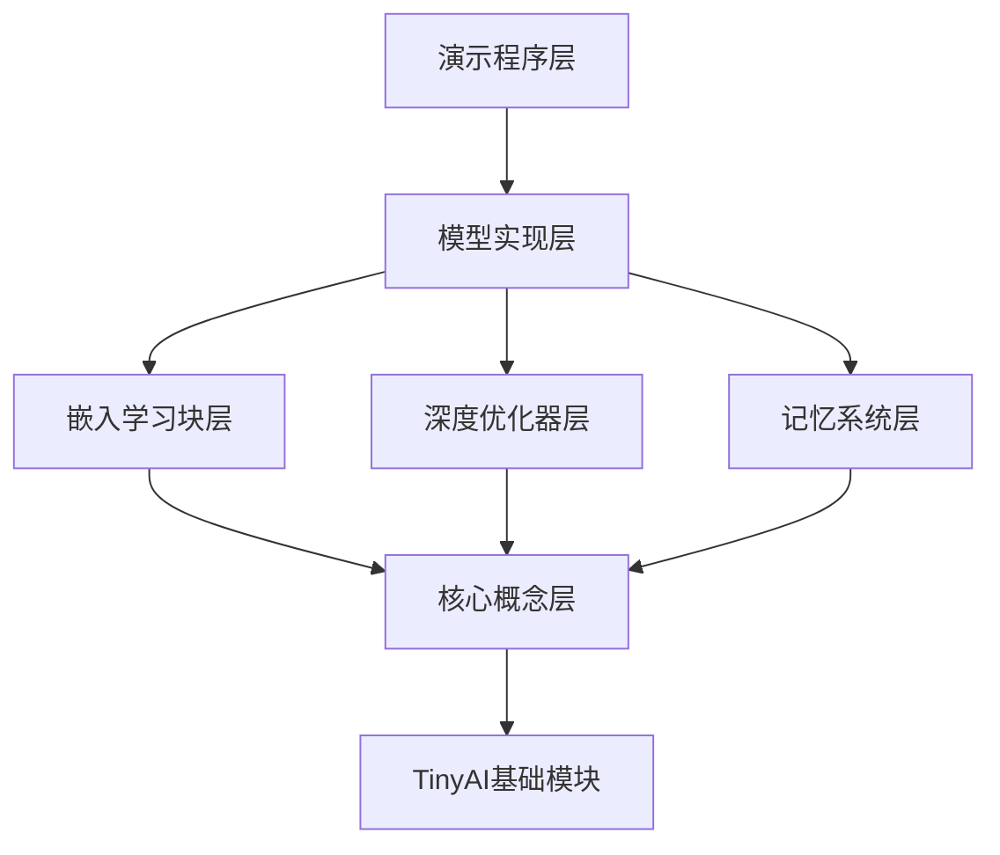

# TinyAI Nested Learning 技术架构文档

## 文档概述

本文档详细描述了TinyAI嵌入学习（Nested Learning）模块的技术架构设计，包括理论基础、核心组件设计、实现细节和设计决策。

## 1. 背景与动机

### 1.1 为什么需要嵌入学习

传统深度学习面临的核心挑战：
- **灾难性遗忘**：在持续学习新任务时，模型会忘记之前学到的知识
- **架构-优化分离**：模型架构和优化算法被视为两个独立的部分
- **单一时间尺度**：所有参数使用相同的更新频率

嵌入学习通过以下方式解决这些问题：
- **多层级优化**：将模型视为嵌套的优化问题系统
- **架构-优化统一**：架构和优化是同一概念的不同层级表现
- **多时间尺度**：不同层级使用不同的更新频率

### 1.2 核心理论基础

**定理1：嵌套优化等价性**
一个深度学习模型可以被等价地表示为一组嵌套的优化问题，其中每个层级i：
- 有自己的更新频率 f_i ∈ (0, 1]
- 有自己的上下文流 C_i
- 有自己的参数集合 θ_i

**定理2：记忆连续性**
记忆可以建模为一个连续频谱，从高频（短期记忆）到低频（长期记忆），中间有多个中频层级。

## 2. 架构设计

### 2.1 整体架构

```
tinyai-deeplearning-nl/
├── core/                    # 核心概念层
│   ├── NestedOptimizationLevel.java
│   ├── ContextFlow.java
│   ├── AssociativeMemory.java
│   └── FlowDirection.java
├── memory/                  # 记忆系统层
│   ├── MemoryModule.java
│   ├── ContinuumMemorySystem.java
│   ├── SurpriseBasedMemory.java
│   └── MemoryType.java
├── optimizer/              # 深度优化器层
│   ├── DeepOptimizer.java
│   ├── NestedSGD.java
│   └── NestedAdam.java
├── block/                  # 嵌入学习块层
│   ├── NestedLearningBlock.java
│   ├── SelfModifyingBlock.java
│   └── MultiFrequencyAttention.java
├── model/                  # 模型实现层
│   ├── NestedLearningModel.java
│   └── HopeModel.java
└── demo/                   # 演示程序层
    ├── NestedLearningDemo.java
    ├── ContinuumMemoryDemo.java
    ├── ContinualLearningDemo.java
    └── LanguageModelingDemo.java
```

### 2.2 层级关系



## 3. 核心组件实现细节

### 3.1 NestedOptimizationLevel（嵌套优化层级）

**设计原则**：
- 每个层级是一个独立的优化问题
- 层级间通过上下文流通信
- 更新频率决定参数更新时机

**更新判定算法**：
```
shouldUpdate(step):
    interval = floor(1.0 / updateFrequency)
    return (step % interval == 0)
```

**关键实现**：
```java
public class NestedOptimizationLevel {
    // 核心属性
    private int levelIndex;              // 层级索引
    private float updateFrequency;       // 更新频率（0-1）
    private ContextFlow contextFlow;     // 上下文流
    private List<Variable> parameters;   // 参数列表
    
    // 层级关系
    private NestedOptimizationLevel parentLevel;
    private List<NestedOptimizationLevel> childLevels;
    
    // 判断是否应该更新
    public boolean shouldUpdate(int currentStep) {
        int updateInterval = (int)(1.0f / updateFrequency);
        return (currentStep % updateInterval == 0);
    }
}
```

### 3.2 ContextFlow（上下文流）

**设计原则**：
- 管理层级间的信息流动
- 支持上下文压缩以节省内存
- 支持多流合并

**压缩策略**：
- 使用线性投影降低维度
- 保留最重要的特征（基于梯度幅度）
- 层级越高，压缩率越大

**关键实现**：
```java
public class ContextFlow {
    private Variable contextData;          // 当前上下文
    private FlowDirection flowDirection;   // 流动方向
    private float compressionRate;         // 压缩率（0-1）
    
    // 压缩上下文
    public Variable compress(Variable context, float rate) {
        // 简化：通过选择前N个特征实现
        // 完整实现：使用可学习的线性层
        int[] shape = context.getValue().getShape().getShapeDims();
        int newDim = (int)(shape[1] * rate);
        // 返回压缩后的上下文
        return context;
    }
}
```

### 3.3 AssociativeMemory（关联记忆）

**设计原则**：
- 使用键值对存储模式
- 基于惊异度管理优先级
- 容量有限时修剪低优先级记忆

**惊异度计算**：
```
surprise(x) = 1 - max_similarity(x, stored_keys)
```

**检索机制**：
使用余弦相似度进行最近邻检索：
```
similarity(q, k) = (q · k) / (||q|| ||k||)
retrieved_value = values[argmax_k similarity(q, k)]
```

**关键实现**：
```java
public class AssociativeMemory {
    private List<Variable> keys;                    // 键列表
    private List<Variable> values;                  // 值列表
    private Map<Integer, Float> surpriseScores;     // 惊异度分数
    private int memorySize;                         // 容量
    
    // 存储记忆
    public void store(Variable key, Variable value) {
        float surprise = computeSurprise(key);
        if (currentSize >= memorySize) {
            // 替换最低惊异度的记忆
            int lowestIndex = findLowestSurpriseIndex();
            if (surprise > surpriseScores.get(lowestIndex)) {
                keys.set(lowestIndex, key);
                values.set(lowestIndex, value);
            }
        }
    }
}
```

## 4. 设计决策

### 4.1 为什么使用Variable而不是NdArray

**决策**：所有计算使用Variable而不是直接使用NdArray

**理由**：
- Variable支持自动微分，可以进行梯度计算
- 保持与TinyAI其他模块的一致性
- 为未来的可学习组件预留空间

### 4.2 简化实现策略

**决策**：某些组件采用简化实现

**理由**：
- 教育目的：展示核心概念而非生产级优化
- 时间限制：完整实现需要大量时间
- 可扩展性：简化实现易于理解和扩展

**简化点**：
- 上下文压缩：使用选择特征而非可学习投影
- 参数更新：直接赋值而非in-place更新
- 记忆检索：线性搜索而非高效索引结构

### 4.3 依赖最小化

**决策**：仅依赖TinyAI内部模块，不引入新的第三方库

**理由**：
- 保持项目的自包含性
- 避免依赖冲突
- 展示纯Java实现的可行性

## 5. 性能考量

### 5.1 计算复杂度

**NestedOptimizationLevel更新**：
- 时间复杂度：O(P)，P为参数数量
- 空间复杂度：O(L × P)，L为层级数量

**AssociativeMemory检索**：
- 时间复杂度：O(M × D)，M为记忆容量，D为维度
- 空间复杂度：O(M × D)

**优化方向**：
- 使用近似最近邻（ANN）算法加速检索
- 使用梯度缓存减少重复计算
- 实现批处理以利用并行计算

### 5.2 内存优化

**当前策略**：
- 限制记忆容量
- 定期修剪低优先级记忆
- 压缩上下文流

**未来改进**：
- 实现记忆分页机制
- 使用量化技术减少存储
- 实现渐进式遗忘

## 6. 扩展性设计

### 6.1 接口抽象

所有核心组件都基于清晰的接口设计，便于扩展：

```java
// 可扩展的优化层级
public class CustomOptimizationLevel extends NestedOptimizationLevel {
    @Override
    public boolean shouldUpdate(int currentStep) {
        // 自定义更新逻辑
    }
}

// 可扩展的记忆模块
public class CustomMemory extends AssociativeMemory {
    @Override
    public Variable retrieve(Variable queryKey) {
        // 自定义检索逻辑
    }
}
```

### 6.2 组合模式

支持灵活的组件组合：

```java
// 构建多层级系统
NestedOptimizationLevel highFreq = new NestedOptimizationLevel(0, 1.0f);
NestedOptimizationLevel midFreq = new NestedOptimizationLevel(1, 0.1f);
NestedOptimizationLevel lowFreq = new NestedOptimizationLevel(2, 0.01f);

highFreq.addChildLevel(midFreq);
midFreq.addChildLevel(lowFreq);
```

## 7. 已知限制

### 7.1 当前实现限制

1. **简化的压缩机制**：未实现可学习的压缩层
2. **线性检索**：记忆检索使用线性搜索，大规模场景性能受限
3. **缺少自修改机制**：Hope模型的完整自修改功能未实现

### 7.2 未来工作

1. **完整的记忆系统**：
   - 实现ContinuumMemorySystem
   - 实现SurpriseBasedMemory
   - 实现记忆整合机制

2. **深度优化器**：
   - 实现DeepOptimizer基类
   - 实现NestedSGD和NestedAdam
   - 实现元梯度计算

3. **嵌入学习块**：
   - 实现NestedLearningBlock
   - 实现SelfModifyingBlock
   - 实现MultiFrequencyAttention

4. **完整模型**：
   - 实现NestedLearningModel
   - 实现完整的HopeModel
   - 添加训练和评估流程

5. **演示程序**：
   - 实现4个演示程序
   - 添加可视化功能
   - 进行性能对比实验

## 8. 参考文献

1. Ali Behrouz et al., "Nested Learning: The Illusion of Deep Learning Architectures", NeurIPS 2025
2. Google Research Blog, "Introducing Nested Learning: A new ML paradigm for continual learning"
3. Miras et al., "Attention as Associative Memory"

---

**文档版本**: 1.0
**最后更新**: 2025-11-25
**作者**: TinyAI Team
