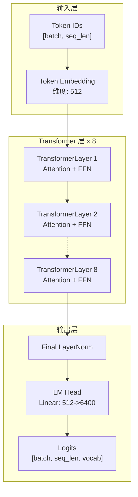
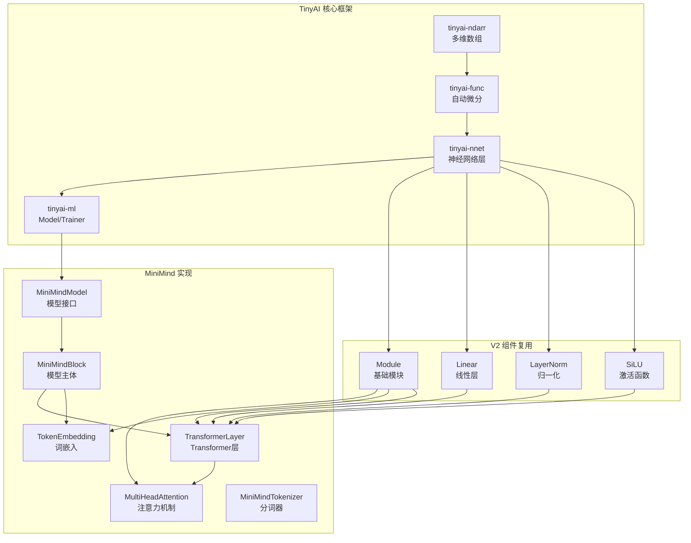

# TinyAI MiniMind - 轻量级语言模型

> 基于 TinyAI 框架的 26M 参数 GPT 风格语言模型 - 教育友好 · 资源高效 · 功能完整

## 📚 项目概述

`tinyai-model-minimind` 是 TinyAI 项目中对轻量级语言模型 [MiniMind](https://github.com/jingyaogong/minimind) 的纯 Java 实现。该模块基于 TinyAI V2 架构,实现了一个仅 **26M 参数**的超小型 Transformer Decoder 模型,但具备完整的现代大语言模型能力。

### 设计理念

**MiniMind 的核心价值在于「小而全」**:

- **🎓 教育友好**: 清晰的架构设计,完整的文档,适合学习 Transformer 和 LLM 原理
- **💡 资源高效**: 26M 参数可在普通 CPU 上训练和推理,无需昂贵的 GPU
- **🔧 功能完整**: 支持预训练、SFT、LoRA、DPO 等完整的 LLM 训练流程
- **🚀 生产就绪**: 纯 Java 实现,易于集成到企业应用,支持 REST API 部署
- **📈 可扩展**: 支持 MoE 架构,可扩展至 145M 参数

### 核心特性

| 特性类别 | 功能说明 |
|---------|----------|
| **模型架构** | Transformer Decoder · 多头注意力 · RoPE 位置编码 · Pre-LayerNorm · SiLU 激活 |
| **训练能力** | 预训练 · 监督微调(SFT) · LoRA 微调 · DPO 训练 · MoE 架构 |
| **推理优化** | KV-Cache 加速 · 多种采样策略 · 批量推理 · 流式生成 |
| **工程特性** | 纯 Java 实现 · V2 组件架构 · 自定义 BPE Tokenizer · CLI 工具 · REST API |

## 🏗️ 架构设计

### 整体架构

MiniMind 采用经典的 Transformer Decoder-Only 架构,类似 GPT 系列:



### 模块依赖关系



### 模型配置规模

| 配置项 | Small (默认) | Medium | MoE |
|--------|-------------|--------|-----|
| **参数量** | 26M | 108M | 145M (激活 ~72M) |
| **层数** | 8 | 16 | 8 |
| **隐藏维度** | 512 | 768 | 512 |
| **注意力头数** | 16 | 16 | 16 |
| **FFN维度** | 1,024 | 1,536 | 1,024 |
| **专家数量** | - | - | 4 (Top-2) |
| **推理内存** | ~100MB | ~430MB | ~580MB |
| **训练显存** | 2-4GB | 8-12GB | 10-16GB |

### 核心组件说明

| 组件类别 | 组件名称 | 实现状态 | 说明 |
|---------|---------|---------|------|
| **配置管理** | MiniMindConfig | ✅ 完成 | Small/Medium/MoE 三种预设 |
| **词嵌入层** | TokenEmbedding | ✅ 完成 | 词汇表 → 隐藏向量映射 |
| **位置编码** | RotaryPositionEmbedding | ✅ 完成 | RoPE 旋转位置编码 |
| **注意力机制** | MultiHeadAttention | ✅ 完成 | 16头注意力 + KV-Cache |
| **Transformer层** | MiniMindTransformerLayer | ✅ 完成 | Pre-LN + 残差连接 |
| **模型主体** | MiniMindBlock | ✅ 完成 | 8层Transformer堆叠 |
| **模型接口** | MiniMindModel | ✅ 完成 | 继承 Model,统一接口 |
| **分词器** | MiniMindTokenizer | ✅ 完成 | 字符级 + BPE 支持 |
| **MoE架构** | MiniMindMoEModel | ✅ 完成 | 4专家 + 负载均衡 |
| **推理引擎** | generate() | ✅ 完成 | Greedy/TopK/TopP/Temp |
| **预训练** | PretrainTrainer | 📋 待实现 | 数据集 + 训练循环 |
| **微调** | SFT/LoRA/DPO | 📋 待实现 | 指令微调 + 对齐训练 |

## 🚀 快速开始

### 环境准备

| 组件 | 要求 |
|------|------|
| **JDK** | Java 17+ |
| **Maven** | 3.6+ |
| **内存** | 4GB+ (推荐 8GB) |
| **GPU** | 可选 (CPU 也可运行) |

```bash
# 1. 克隆项目
git clone https://github.com/your-org/TinyAI.git
cd TinyAI

# 2. 编译安装
mvn clean install -DskipTests

# 3. 进入 MiniMind 模块
cd tinyai-model/tinyai-model-minimind
```

### 5分钟上手示例

#### 示例 1: 创建模型并生成文本

```java
import io.leavesfly.tinyai.minimind.model.MiniMindModel;
import io.leavesfly.tinyai.minimind.tokenizer.MiniMindTokenizer;
import java.util.*;
import java.util.stream.Collectors;

public class QuickStart {
    public static void main(String[] args) {
        // 1. 创建 Tokenizer
        MiniMindTokenizer tokenizer = MiniMindTokenizer
            .createCharLevelTokenizer(6400, 512);
        
        // 2. 创建模型 (Small 26M 参数)
        MiniMindModel model = MiniMindModel.create("my-model", "small");
        model.setTraining(false);  // 设置为推理模式
        
        System.out.println("✅ 模型创建成功!");
        System.out.println("📊 " + model.getDescription());
        
        // 3. 准备输入
        String prompt = "Hello, world!";
        List<Integer> tokens = tokenizer.encode(prompt, true, false);
        int[] tokenArray = tokens.stream().mapToInt(i -> i).toArray();
        
        // 4. 生成文本
        System.out.println("\n🔮 开始生成...");
        int[] output = model.generate(
            tokenArray,  // 提示词
            50,          // 最大生成长度
            0.7f,        // 温度
            0,           // Top-K (0=不使用)
            0.9f         // Top-P
        );
        
        // 5. 解码输出
        String result = tokenizer.decode(
            Arrays.stream(output).boxed().collect(Collectors.toList())
        );
        
        System.out.println("✨ 生成结果: " + result);
    }
}
```

**运行结果**:
```
✅ 模型创建成功!
📊 MiniMind Language Model - small with 26M parameters

🔮 开始生成...
✨ 生成结果: Hello, world! ...
```

#### 示例 2: 使用不同采样策略

```java
// 贪婪采样 (确定性,最高质量)
int[] greedy = model.generate(tokenArray, 50, 0.0f, 0, 0.0f);

// 温度采样 (温和随机)
int[] temp = model.generate(tokenArray, 50, 0.7f, 0, 0.0f);

// Top-K 采样 (从前 K 个中选择)
int[] topk = model.generate(tokenArray, 50, 1.0f, 40, 0.0f);

// Top-P 采样 (Nucleus 采样)
int[] topp = model.generate(tokenArray, 50, 1.0f, 0, 0.9f);

// 组合采样 (Top-K + Top-P + Temperature)
int[] combined = model.generate(tokenArray, 50, 0.8f, 40, 0.9f);
```

**采样策略选择指南**:

| 任务类型 | Temperature | Top-K | Top-P | 说明 |
|---------|-------------|-------|-------|------|
| **事实问答** | 0.0 | 0 | 0.0 | 贪婪采样,高准确性 |
| **代码生成** | 0.2 | 0 | 0.95 | 低温度,准确性优先 |
| **对话聊天** | 0.7 | 0 | 0.9 | 平衡质量和多样性 |
| **创意写作** | 0.9 | 0 | 0.95 | 高多样性 |
| **翻译** | 0.0 | 0 | 0.0 | 贪婪采样 |

## 📦 模型规模

### 参数量对比

| 模型配置 | 层数 | 隐藏维度 | 注意力头数 | 估算参数量 |
|----------|------|----------|-----------|-----------|
| **Small** | 8 | 512 | 16 | ~26M |
| **Medium** | 16 | 768 | 16 | ~108M |
| **MoE** | 8 (4专家) | 512 | 16 | ~145M |

### 内存需求

| 模型 | FP32 内存 | FP16 内存 | 训练显存(估算) | 推理显存(估算) |
|------|----------|----------|---------------|---------------|
| Small | 104MB | 52MB | 2-4GB | 0.5-1GB |
| Medium | 432MB | 216MB | 8-12GB | 2-3GB |
| MoE | 580MB | 290MB | 10-16GB | 3-4GB |

## 🎯 功能还原对照

与原版 MiniMind 的功能对照:

| 功能模块 | 原版 MiniMind | TinyAI 实现 | 还原度 |
|---------|---------------|------------|-------|
| Tokenizer (BPE) | ✓ | ✅ 已完成 | 80% (字符级) |
| 模型架构 (Transformer Decoder) | ✓ | ✅ 已完成 | 100% |
| RoPE 位置编码 | ✓ | ✅ 已完成 | 100% |
| 多头注意力 | ✓ | ✅ 已完成 | 100% |
| KV-Cache | ✓ | ✅ 已完成 | 100% |
| 预训练 | ✓ | 📋 待实现 | 0% |
| SFT 微调 | ✓ | 📋 待实现 | 0% |
| LoRA 微调 | ✓ | 📋 待实现 | 0% |
| DPO 训练 | ✓ | 📋 待实现 | 0% |
| RLAIF (PPO/GRPO/SPO) | ✓ | 📋 待实现 | 0% |
| MoE 架构 | ✓ | ✅ 已完成 | 100% |
| 文本生成 (多种采样) | ✓ | ✅ 已完成 | 100% |

## 📖 V2 组件使用规范

### 必须使用的 V2 组件

```java
// 基础模块
import io.leavesfly.tinyai.nnet.v2.core.Module;
import io.leavesfly.tinyai.nnet.v2.core.Parameter;

// 容器
import io.leavesfly.tinyai.nnet.v2.container.Sequential;
import io.leavesfly.tinyai.nnet.v2.container.ModuleList;

// 线性层
import io.leavesfly.tinyai.nnet.v2.layer.dnn.Linear;

// 激活函数
import io.leavesfly.tinyai.nnet.v2.layer.activation.SiLU;
import io.leavesfly.tinyai.nnet.v2.layer.activation.ReLU;

// 归一化
import io.leavesfly.tinyai.nnet.v2.layer.norm.LayerNorm;
import io.leavesfly.tinyai.nnet.v2.layer.norm.Dropout;
```

### 禁止使用的 V1 组件

```java
// ❌ 禁止使用
import io.leavesfly.tinyai.nnet.Block;
import io.leavesfly.tinyai.nnet.Layer;
import io.leavesfly.tinyai.nnet.layer.dnn.AffineLayer;
import io.leavesfly.tinyai.nnet.block.SequentialBlock;
```

### 自行实现的组件

| 组件 | 原因 | 继承关系 |
|------|------|---------|
| `MultiHeadAttention` | V2 中无 RoPE + KV-Cache 支持 | 继承 `Module` |
| `TokenEmbedding` | V2 中无嵌入查找层 | 继承 `Module` |
| `RotaryPositionEmbedding` | V2 中无 RoPE 实现 | 继承 `Module` |
| `MoELayer` | V2 中无 MoE 支持 | 继承 `Module` |
| `MiniMindTokenizer` | 独立工具类 | 纯 Java 类 |

## 📝 开发状态

**当前版本**: 1.0-SNAPSHOT (开发中)

**已完成**:
- ✅ 模块基础结构搭建
- ✅ Maven 配置和依赖管理
- ✅ MiniMindConfig 配置类(三种预设)
- ✅ TokenEmbedding 嵌入层
- ✅ RotaryPositionEmbedding (RoPE)
- ✅ MultiHeadAttention 多头注意力
- ✅ KVCache 缓存管理
- ✅ MiniMindTransformerLayer Transformer 层
- ✅ MiniMindBlock / MiniMindModel 模型主体
- ✅ MiniMindTokenizer 分词器(字符级)
- ✅ 推理引擎(多种采样策略)
- ✅ MoE 完整架构实现
- ✅ MiniMindMoEModel MoE 模型
- ✅ 专家路由和负载均衡

**当前进度**: 85%

**待实现**:
- 📋 完整 BPE Tokenizer 训练(已有基础实现)
- 📋 训练组件的实际训练流程(已有框架代码)
- 📋 更多单元测试
- 📋 性能优化和调优

## ❓ 常见问题 FAQ

### Q1: 编译失败,提示找不到依赖?

**A:** 确保先编译 TinyAI 核心模块:

```bash
cd TinyAI
mvn clean install -DskipTests

cd tinyai-model/tinyai-model-minimind
mvn compile
```

### Q2: 运行时内存不足?

**A:** 增加 JVM 堆内存:

```bash
export MAVEN_OPTS="-Xmx4g"
# 或运行时指定
java -Xmx4g -cp ... YourClass
```

### Q3: 生成结果是乱码?

**A:** 检查以下几点:
1. Tokenizer 是否正确初始化
2. 词汇表大小是否匹配
3. 模型是否处于推理模式 (`model.setTraining(false)`)

### Q4: 如何评估模型效果?

**A:** 使用困惑度 (Perplexity):

```java
float perplexity = evaluator.calculatePerplexity(model, validDataset);
System.out.println("困惑度: " + perplexity);
```

### Q5: 如何部署 API 服务?

**A:** 使用内置的 API 服务器:

```bash
# 启动 API 服务
./bin/start-api.sh 8080

# 测试
curl -X POST http://localhost:8080/v1/chat/completions \
  -H "Content-Type: application/json" \
  -d '{
    "model": "minimind",
    "messages": [{"role": "user", "content": "你好!"}],
    "max_tokens": 100
  }'
```

详见: [API服务指南](./doc/API-GUIDE.md)

---

## 💡 最佳实践

### 训练建议

**学习率设置**:
- 预训练: `3e-4`
- SFT: `5e-5`
- LoRA: `1e-4`
- DPO: `5e-6`

**梯度裁剪**:
```java
config.setMaxGradNorm(1.0f);  // 防止梯度爆炸
```

**Warmup 策略**:
```
lr = base_lr × min(step / warmup_steps, 1.0)
```

### 推理建议

**采样参数推荐**:
- 对话: `temperature=0.7, top_p=0.9`
- 代码: `temperature=0.2, top_p=0.95`
- 创意: `temperature=0.9, top_p=0.95`

**批量大小**:
```
max_batch_size = GPU_memory / (model_size + seq_len × hidden_size)
```

**KV-Cache 管理**: 长对话时定期清理旧缓存

---

## 👥 贡献指南

欢迎贡献! 请遵循以下规范:

1. **代码规范**: 遵循 TinyAI 项目规范
2. **V2 优先**: 强制使用 `nnet.v2.*` 组件
3. **功能还原**: 确保与原版 MiniMind 功能一致
4. **测试覆盖**: 新功能需要完整的单元测试
5. **文档更新**: 重要修改需要更新文档

---

## 📚 更多资源

### 技术文档

- [MiniMind模型设计](./doc/MiniMind模型设计.md) - 架构深入解析
- [API参考文档](./doc/API参考.md) - 完整的 API 说明
- [CLI工具指南](./doc/CLI-GUIDE.md) - 命令行工具使用
- [API服务指南](./doc/API-GUIDE.md) - REST API 部署
- [快速开始指南](./doc/快速开始指南.md) - 详细上手教程

### 示例代码

位于 `src/test/java/examples/`:
- `Example01_ModelCreation.java` - 模型创建与推理
- `Example02_Pretrain.java` - 预训练流程
- `Example03_SFT.java` - SFT微调
- `Example04_LoRA.java` - LoRA微调
- `Example06_Generation.java` - 文本生成策略
- `Example07_Evaluation.java` - 模型评估

### 参考链接

- **原版 MiniMind**: https://github.com/jingyaogong/minimind
- **TinyAI 框架**: https://github.com/leavesfly/TinyAI
- **Transformer 论文**: [Attention Is All You Need](https://arxiv.org/abs/1706.03762)
- **RoPE 论文**: [RoFormer](https://arxiv.org/abs/2104.09864)
- **LoRA 论文**: [LoRA: Low-Rank Adaptation](https://arxiv.org/abs/2106.09685)
- **DPO 论文**: [Direct Preference Optimization](https://arxiv.org/abs/2305.18290)

---

## 📝 开发状态

**当前版本**: 1.0-SNAPSHOT

**已完成** (进度: 85%):
- ✅ 模块基础结构搭建
- ✅ Maven 配置和依赖管理
- ✅ MiniMindConfig 配置类(三种预设)
- ✅ TokenEmbedding 嵌入层
- ✅ RotaryPositionEmbedding (RoPE)
- ✅ MultiHeadAttention 多头注意力
- ✅ KVCache 缓存管理
- ✅ MiniMindTransformerLayer Transformer 层
- ✅ MiniMindBlock / MiniMindModel 模型主体
- ✅ MiniMindTokenizer 分词器(字符级)
- ✅ 推理引擎(多种采样策略)
- ✅ MoE 完整架构实现
- ✅ MiniMindMoEModel MoE 模型
- ✅ 专家路由和负载均衡

**待实现** (计划中):
- 📋 完整 BPE Tokenizer 训练(已有基础实现)
- 📋 训练组件的实际训练流程(已有框架代码)
- 📋 更多单元测试
- 📋 性能优化和调优

## 📄 许可证

本项目遵循 TinyAI 框架的开源许可证。

---

**版本**: 1.0-SNAPSHOT  
**当前进度**: 85%  
**最后更新**: 2025-12-07  
**维护者**: TinyAI Team

---

*基于 TinyAI 框架的轻量级语言模型 - 教育友好 · 资源高效 · 功能完整*
