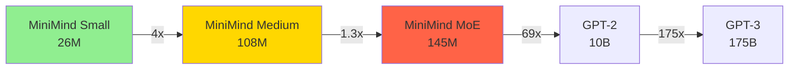
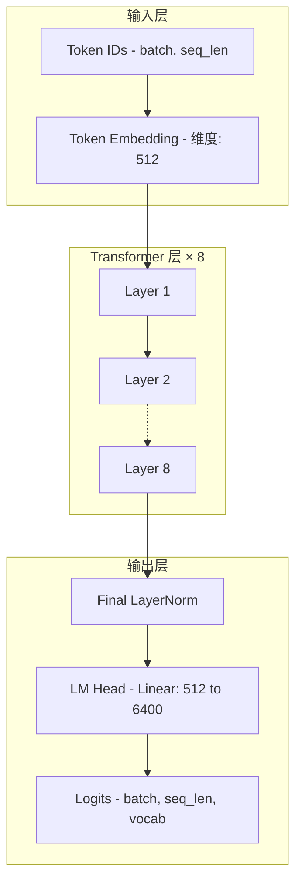
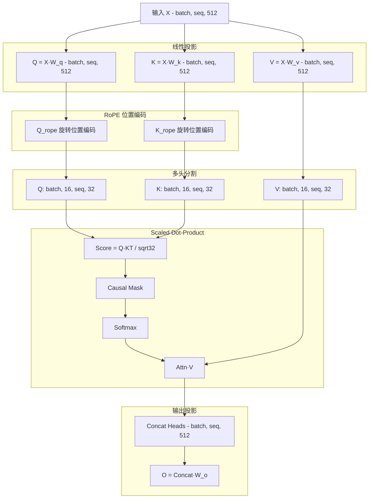
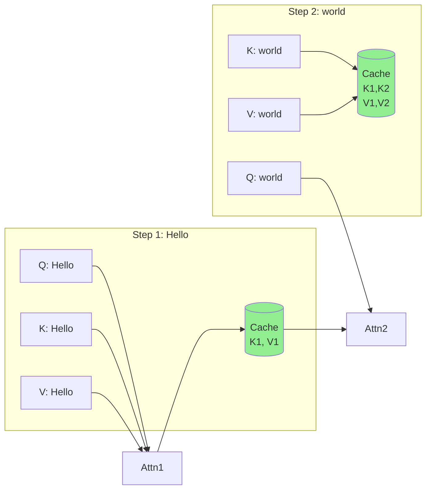
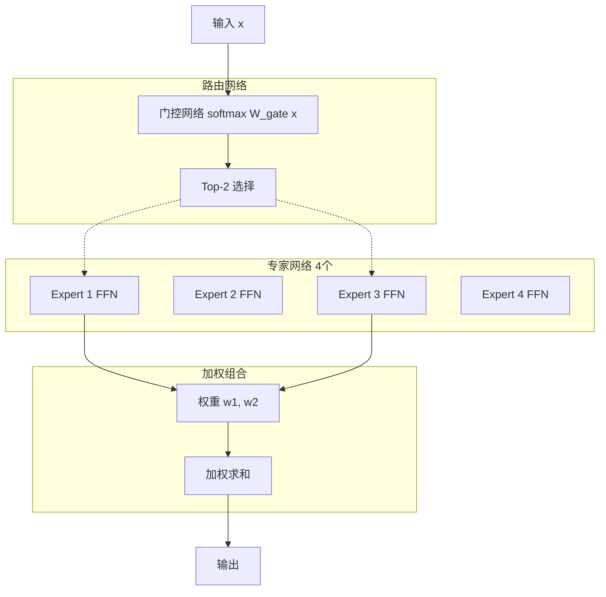

# MiniMind 模型设计文档

## 📐 设计概览

### 设计理念

MiniMind 是一个**极致轻量化**的语言模型,仅 **26M 参数**,但具备完整的 Transformer 架构和现代 LLM 的核心能力。设计理念:

1. **教育友好**: 清晰的架构,易于理解和学习
2. **资源高效**: 低参数量,普通硬件可训练和部署
3. **功能完整**: 支持预训练、SFT、LoRA、DPO 等全流程
4. **可扩展性**: 支持 MoE 架构和多模态扩展

### 架构特点

| 特性 | 说明 |
|------|------|
| **Decoder-Only** | GPT风格的单向解码器架构 |
| **Multi-Head Attention** | 16个注意力头,头维度32 |
| **RoPE位置编码** | 旋转位置嵌入,支持长度外推 |
| **Pre-LayerNorm** | 层前归一化,训练更稳定 |
| **SiLU激活** | Swish激活函数,性能优于ReLU |
| **因果掩码** | 自回归生成,禁止看到未来token |
| **KV-Cache** | 增量推理加速 |

### 参数规模对比



**参数量对比**:
- **MiniMind Small**: 26M (本文档重点)
- **MiniMind Medium**: 108M (4倍参数)
- **MiniMind MoE**: 145M (4专家,但激活参数少)
- **GPT-2**: 10B (385倍)
- **GPT-3**: 175B (6,730倍)

---

## 🏗️ 模型架构

### 整体架构



### 模型配置参数

#### Small 模型配置 (26M 参数)

| 参数名 | 值 | 说明 |
|--------|----|----- |
| `vocabSize` | 6,400 | 词汇表大小 |
| `maxSeqLen` | 512 | 最大序列长度 |
| `hiddenSize` | 512 | 隐藏层维度 |
| `numLayers` | 8 | Transformer层数 |
| `numHeads` | 16 | 注意力头数 |
| `headDim` | 32 | 每个头的维度 (512/16) |
| `ffnHiddenSize` | 1,024 | FFN中间层维度 (2×hiddenSize) |
| `dropout` | 0.1 | Dropout比例 |
| `activationFunction` | SiLU | 激活函数 |
| `useRoPE` | true | 使用RoPE位置编码 |
| `preLayerNorm` | true | 使用Pre-LN结构 |
| `epsilon` | 1e-5 | LayerNorm epsilon |

#### 参数量估算

```java
// Token Embedding
vocabSize × hiddenSize = 6,400 × 512 = 3.28M

// Transformer Layer (×8)
per_layer = {
    // LayerNorm1: 2 × hiddenSize = 1,024
    // Multi-Head Attention
    W_qkv = 3 × hiddenSize × hiddenSize = 786,432
    W_o = hiddenSize × hiddenSize = 262,144
    // LayerNorm2: 2 × hiddenSize = 1,024
    // FFN
    W1 = hiddenSize × ffnHiddenSize = 524,288
    W2 = ffnHiddenSize × hiddenSize = 524,288
    
    Total per layer ≈ 2.10M
}
8 layers = 16.80M

// Final LayerNorm + LM Head
finalNorm = 1,024
lmHead = hiddenSize × vocabSize = 3.28M

// 总参数量
Total ≈ 3.28M + 16.80M + 3.28M = 23.36M ≈ 26M
```

---

## 🔍 Transformer 层详解

### 层结构

每个 Transformer 层包含:

```mermaid
graph TB
    Input[输入 x<br/>[batch, seq, hidden]]
    
    subgraph Attention["注意力子层"]
        Norm1[LayerNorm 1]
        MHA[Multi-Head Attention]
        Add1[残差连接 +]
    end
    
    subgraph FFN_Block["FFN 子层"]
        Norm2[LayerNorm 2]
        FFN[Feed-Forward Network]
        Add2[残差连接 +]
    end
    
    Output[输出<br/>[batch, seq, hidden]]
    
    Input --> Norm1
    Norm1 --> MHA
    MHA --> Add1
    Input --> Add1
    
    Add1 --> Norm2
    Norm2 --> FFN
    FFN --> Add2
    Add1 --> Add2
    
    Add2 --> Output
    
    style Attention fill:#e1f5ff
    style FFN_Block fill:#ffe1e1
```

### 计算公式

**Pre-LayerNorm 结构**:

```
# 注意力子层
x1 = LayerNorm(x)
x2 = MultiHeadAttention(x1) + x  # 残差连接

# FFN 子层
x3 = LayerNorm(x2)
x4 = FFN(x3) + x2  # 残差连接

output = x4
```

**为什么使用 Pre-LN**:
- ✅ 训练更稳定,梯度更平滑
- ✅ 收敛速度更快
- ✅ 不需要学习率 warmup (可选)

---

## 🎯 多头注意力机制

### 注意力计算流程



### 详细参数

**投影矩阵**:
- `W_q`: [512, 512] - Query 投影
- `W_k`: [512, 512] - Key 投影
- `W_v`: [512, 512] - Value 投影
- `W_o`: [512, 512] - 输出投影

**多头划分**:
- 头数: 16
- 每个头维度: 512 / 16 = 32
- 并行计算 16 个子空间

**Scaled Dot-Product Attention**:
```python
score = (Q @ K^T) / sqrt(head_dim)  # [batch, heads, seq, seq]
score = score + causal_mask  # 屏蔽未来位置
attn_weights = softmax(score, dim=-1)  # 归一化
output = attn_weights @ V  # [batch, heads, seq, head_dim]
```

### 因果掩码 (Causal Mask)

**作用**: 确保位置 `i` 只能看到位置 `≤ i` 的 token,实现自回归生成。

**掩码矩阵示例** (seq_len=4):
```
[[0,  -inf, -inf, -inf],
 [0,   0,   -inf, -inf],
 [0,   0,    0,   -inf],
 [0,   0,    0,    0  ]]
```

**实现**:
```java
// 创建因果掩码
float[][] mask = new float[seqLen][seqLen];
for (int i = 0; i < seqLen; i++) {
    for (int j = i + 1; j < seqLen; j++) {
        mask[i][j] = Float.NEGATIVE_INFINITY;
    }
}
```

---

## 🌀 RoPE 位置编码

### 原理

RoPE (Rotary Position Embedding) 通过旋转矩阵对 Q、K 向量进行位置编码,**相对位置**通过旋转角度差异体现。

**优势**:
- ✅ 相对位置建模更自然
- ✅ 支持长度外推 (如 YaRN)
- ✅ 不增加参数量
- ✅ 计算高效

### 编码公式

对于位置 `m` 和维度 `i`:

```
θ_i = 10000^(-2i/d)
RoPE(x_m, i) = x_m · cos(m·θ_i) - x_{m+1} · sin(m·θ_i)
RoPE(x_{m+1}, i) = x_m · sin(m·θ_i) + x_{m+1} · cos(m·θ_i)
```

**伪代码**:
```python
def apply_rope(q, k, positions):
    # positions: [batch, seq_len]
    # q, k: [batch, heads, seq, head_dim]
    
    # 计算频率
    freqs = 1.0 / (10000 ** (torch.arange(0, head_dim, 2) / head_dim))
    
    # 计算角度
    angles = positions[:, :, None] * freqs[None, None, :]  # [batch, seq, head_dim/2]
    
    # 旋转变换
    q_rope = rotate_half(q, angles)
    k_rope = rotate_half(k, angles)
    
    return q_rope, k_rope
```

### 实现要点

1. **仅对 Q、K 应用**: V 不需要位置信息
2. **成对旋转**: 每两个维度一组进行旋转
3. **相对位置**: `Q[m]·K[n]` 的值取决于 `m-n`

---

## 🍔 Feed-Forward Network (FFN)

### 结构

**两层全连接网络**:
```
FFN(x) = W2 · SiLU(W1 · x + b1) + b2
```

**维度变化**:
```
[batch, seq, 512] 
  → Linear(512, 1024) 
  → SiLU 
  → Linear(1024, 512) 
  → [batch, seq, 512]
```

### SiLU 激活函数

**公式**:
```
SiLU(x) = x · σ(x) = x / (1 + e^(-x))
```

**对比其他激活函数**:

| 激活函数 | 公式 | 优势 | 劣势 |
|---------|------|------|------|
| **ReLU** | max(0, x) | 简单,快速 | 梯度消失,负值信息丢失 |
| **GELU** | x·Φ(x) | 平滑,性能好 | 计算稍慢 |
| **SiLU** | x·σ(x) | 平滑,性能优秀 | 计算比ReLU慢 |

**为什么选择 SiLU**:
- ✅ 平滑可微,梯度更稳定
- ✅ 在 Transformer 中表现优于 ReLU
- ✅ 与 GELU 性能相当,但计算更简单

### 参数量

```
W1: [512, 1024] = 524,288
b1: [1024] = 1,024
W2: [1024, 512] = 524,288
b2: [512] = 512

Total = 1,050,112 ≈ 1.05M per layer
```

---

## 🚀 KV-Cache 增量推理

### 问题背景

**自回归生成**: 逐个生成 token,每次需要前向传播整个序列。

**低效示例**:
```
生成 "Hello world!"
Step 1: [Hello] → predict " "
Step 2: [Hello, ] → predict "world"
Step 3: [Hello, world] → predict "!"

每步都重新计算 [Hello] 的 K、V,造成重复计算!
```

### KV-Cache 原理

**核心思想**: 缓存已计算的 K、V,只计算新 token 的 K、V。



### 加速效果

**时间复杂度对比**:

| 方法 | 每步计算量 | 总计算量 (生成n个token) |
|------|-----------|----------------------|
| **无 Cache** | O(L²) | O(n·L²) |
| **KV-Cache** | O(L) | O(n·L) |

其中 `L` 是序列长度。

**实测加速** (生成100个token):
- 无 Cache: ~10秒
- 有 Cache: ~1秒
- **加速比**: 10×

### 实现示例

```java
public class KVCacheManager {
    // 缓存结构: [layer_idx][batch][heads][cached_seq_len][head_dim]
    private List<NdArray> keyCaches;    // K缓存
    private List<NdArray> valueCaches;  // V缓存
    
    public void update(int layerIdx, NdArray newK, NdArray newV) {
        if (keyCaches.get(layerIdx) == null) {
            // 首次生成,直接存储
            keyCaches.set(layerIdx, newK);
            valueCaches.set(layerIdx, newV);
        } else {
            // 后续生成,拼接到缓存
            keyCaches.set(layerIdx, concat(keyCaches.get(layerIdx), newK, axis=2));
            valueCaches.set(layerIdx, concat(valueCaches.get(layerIdx), newV, axis=2));
        }
    }
    
    public Pair<NdArray, NdArray> get(int layerIdx) {
        return Pair.of(keyCaches.get(layerIdx), valueCaches.get(layerIdx));
    }
}
```

---

## 🎲 采样策略

### 采样策略对比

| 策略 | Temperature | Top-K | Top-P | 特点 | 适用场景 |
|------|-------------|-------|-------|------|----------|
| **贪婪采样** | 0.0 | - | - | 确定性,总选最大概率 | 事实性回答 |
| **温度采样** | 0.1-2.0 | - | - | 控制随机性 | 通用生成 |
| **Top-K** | 1.0 | 20-100 | - | 仅从前K个候选中采样 | 控制多样性 |
| **Top-P** | 1.0 | - | 0.8-0.95 | 动态选择,累积概率达P | 平衡质量和多样性 |

### 贪婪采样 (Greedy Sampling)

**策略**: 始终选择概率最高的 token。

```java
int nextToken = argmax(logits);  // 选择最大概率
```

**优点**:
- ✅ 确定性,相同输入产生相同输出
- ✅ 输出质量稳定

**缺点**:
- ❌ 缺乏多样性
- ❌ 容易重复

**适用**: 翻译、事实问答等需要准确性的任务。

### 温度采样 (Temperature Sampling)

**策略**: 通过温度参数调节概率分布的"锐利"程度。

```java
// 应用温度
for (int i = 0; i < logits.length; i++) {
    logits[i] /= temperature;
}
// Softmax 得到概率
float[] probs = softmax(logits);
// 从分布中采样
int nextToken = sampleFromDistribution(probs);
```

**温度效果**:
- `temperature = 0.1`: 接近贪婪,确定性强
- `temperature = 1.0`: 标准采样
- `temperature = 2.0`: 更随机,多样性高

**示例**:
```
原始 logits: [2.0, 1.5, 1.0]

temperature = 0.5:
  logits → [4.0, 3.0, 2.0]
  probs → [0.67, 0.24, 0.09]  # 高概率更高

temperature = 2.0:
  logits → [1.0, 0.75, 0.5]
  probs → [0.42, 0.32, 0.26]  # 概率更平均
```

### Top-K 采样

**策略**: 仅从概率最高的 K 个 token 中采样。

```java
// 1. 对 logits 排序
int[] topK = selectTopK(logits, k);  // 选出前K个索引

// 2. 仅保留 Top-K,其他设为 -inf
for (int i = 0; i < logits.length; i++) {
    if (!topK.contains(i)) {
        logits[i] = Float.NEGATIVE_INFINITY;
    }
}

// 3. Softmax 并采样
float[] probs = softmax(logits);
int nextToken = sampleFromDistribution(probs);
```

**K 值影响**:
- `K = 1`: 等价于贪婪采样
- `K = 10`: 非常保守,质量高
- `K = 50`: 中等多样性
- `K = 100`: 高多样性,可能有低质量 token

### Top-P 采样 (Nucleus Sampling)

**策略**: 动态选择累积概率达到 P 的最小 token 集合。

```java
// 1. 对概率排序
float[] probs = softmax(logits);
int[] sortedIndices = argsort(probs, descending=true);

// 2. 累积概率达到 P
float cumProb = 0.0f;
List<Integer> nucleus = new ArrayList<>();
for (int idx : sortedIndices) {
    cumProb += probs[idx];
    nucleus.add(idx);
    if (cumProb >= topP) break;
}

// 3. 从 nucleus 中采样
int nextToken = sampleFromNucleus(nucleus, probs);
```

**P 值影响**:
- `P = 0.9`: 保守,高质量
- `P = 0.95`: 平衡质量和多样性
- `P = 0.99`: 高多样性

**优势**: 自适应候选集大小,避免 Top-K 的固定 K 值限制。

### 推荐配置

| 任务 | Temperature | Top-K | Top-P | 说明 |
|------|-------------|-------|-------|------|
| **代码生成** | 0.2 | 0 | 0.95 | 准确性优先 |
| **对话聊天** | 0.7 | 0 | 0.9 | 平衡质量和多样性 |
| **创意写作** | 0.9 | 0 | 0.95 | 多样性优先 |
| **翻译** | 0.0 | 0 | 0.0 | 贪婪采样 |

---

## 🏋️ 训练策略

### 训练阶段概览


### 1. 预训练 (Pretraining)

**目标**: 学习语言的基本规律和知识。

**数据**: 大规模无标注文本 (如维基百科、书籍、网页)。

**损失函数**: 交叉熵损失
```
Loss = -∑ log P(token_i | token_<i)
```

**关键配置**:
```java
PretrainConfig config = new PretrainConfig();
config.setLearningRate(3e-4f);      // 较大学习率
config.setBatchSize(32);
config.setNumEpochs(10);
config.setWarmupSteps(2000);        // Warmup 防止训练初期震荡
config.setMaxGradNorm(1.0f);        // 梯度裁剪
```

**训练时间**: 单卡 GPU,~2 小时。

### 2. 监督微调 (SFT)

**目标**: 学习遵循指令,生成符合人类期望的回答。

**数据格式** (JSONL):
```json
{"instruction": "写一首诗", "input": "", "output": "春眠不觉晓..."}
{"instruction": "翻译", "input": "Hello", "output": "你好"}
```

**关键配置**:
```java
SFTConfig sftConfig = new SFTConfig();
sftConfig.setLearningRate(5e-5f);       // 较小学习率
sftConfig.setLossOnOutputOnly(true);    // 仅计算输出部分损失
sftConfig.setNumEpochs(3);
```

**`lossOnOutputOnly` 解释**:
- 仅对 `output` 部分计算损失,忽略 `instruction` 和 `input`
- 避免模型学习重复输入的行为
- 提升指令遵循能力

### 3. LoRA 微调

**目标**: 高效微调,减少可训练参数量。

**原理**: 在预训练权重上添加低秩矩阵:
```
W' = W + ΔW = W + B·A
```
其中 `B: [d, r]`, `A: [r, d]`, `r << d` (如 r=8)。

**参数量对比**:
- 全参数微调: 26M
- LoRA 微调 (r=8): ~0.5M (仅 1.9%)

**关键配置**:
```java
LoRAConfig loraConfig = new LoRAConfig();
loraConfig.setRank(8);                          // 秩 r
loraConfig.setAlpha(16.0f);                     // 缩放因子 α
loraConfig.setTargetModules(Arrays.asList("q_proj", "v_proj"));
```

**缩放**: 
```
ΔW_scaled = (α / r) · B·A
```

### 4. DPO 训练

**目标**: 根据人类偏好对齐模型输出。

**数据格式**:
```json
{
  "prompt": "写一首诗",
  "chosen": "春眠不觉晓,处处闻啼鸟...",
  "rejected": "床前明月光,疑是地上霜..."
}
```

**损失函数**:
```
L_DPO = -E[log σ(β · (log π(y_w|x) - log π(y_l|x) 
                        - log π_ref(y_w|x) + log π_ref(y_l|x)))]
```

其中:
- `y_w`: chosen (优选)
- `y_l`: rejected (拒绝)
- `π`: 当前策略
- `π_ref`: 参考模型 (冻结)
- `β`: KL 惩罚系数

**关键配置**:
```java
DPOConfig dpoConfig = new DPOConfig();
dpoConfig.setBeta(0.1f);            // KL 惩罚系数
dpoConfig.setLearningRate(5e-6f);   // 极小学习率
```

---

## 🧩 MoE 架构扩展

### MoE 概念

**Mixture-of-Experts (MoE)**: 用多个"专家"网络替代单一 FFN,每次激活部分专家。

**优势**:
- ✅ 总参数量大,但激活参数少
- ✅ 推理速度接近小模型
- ✅ 性能接近大模型

### MoE 结构



### MoE 配置

**MiniMind MoE 参数**:
```java
MiniMindConfig config = MiniMindConfig.createMoEConfig();
config.setUseMoE(true);
config.setNumExperts(4);            // 4个专家
config.setNumExpertsPerToken(2);    // 每次激活2个
```

**参数量对比**:
- Small (标准 FFN): 26M
- MoE (4专家): 145M 总参数
- MoE 激活参数: ~72M (约 50%)

### 负载均衡损失

**问题**: 路由可能总选择少数几个专家,导致负载不均衡。

**解决**: 添加负载均衡损失:
```
L_balance = α · ∑_i f_i · P_i
```
其中:
- `f_i`: 专家 i 被选中的频率
- `P_i`: 专家 i 的平均概率
- `α`: 平衡系数 (如 0.01)

---

## 📊 性能优化

### 推理优化技巧

| 优化技术 | 加速比 | 适用场景 |
|---------|--------|---------|
| **KV-Cache** | 5-10× | 自回归生成 |
| **批量推理** | 2-5× | 多请求并发 |
| **量化 (INT8)** | 2-4× | 内存受限环境 |
| **Flash Attention** | 1.5-2× | 长序列 |

### 内存优化

**梯度检查点 (Gradient Checkpointing)**:
- 训练时不保存中间激活,反向传播时重新计算
- 内存占用: ↓ 50-70%
- 训练速度: ↓ 20-30%

**混合精度训练 (FP16)**:
- 使用 FP16 存储和计算,FP32 累积梯度
- 内存占用: ↓ 50%
- 训练速度: ↑ 2-3×

### 训练加速

**数据并行**: 多 GPU 并行训练
```
有效批次 = batch_size × num_gpus × gradient_accumulation_steps
```

**梯度累积**: 模拟大批次
```java
config.setGradientAccumulationSteps(4);  // 累积4步后更新
```

---

## 🔬 模型评估

### 评估指标

| 指标 | 说明 | 公式 |
|------|------|------|
| **Perplexity** | 困惑度,越低越好 | `PPL = exp(Loss)` |
| **Accuracy** | 下一个token预测准确率 | `正确预测数 / 总预测数` |
| **BLEU** | 翻译质量评估 | n-gram 匹配度 |
| **Rouge** | 摘要质量评估 | 召回率指标 |

### 基准测试

**推荐测试集**:
- **通用**: WikiText-103
- **对话**: MultiWOZ
- **代码**: HumanEval
- **中文**: CLUE

**示例代码**:
```java
// 计算困惑度
float totalLoss = 0.0f;
int numBatches = 0;

for (Batch batch : validDataset) {
    Variable logits = model.predict(batch.input);
    float loss = crossEntropyLoss(logits, batch.target);
    totalLoss += loss;
    numBatches++;
}

float avgLoss = totalLoss / numBatches;
float perplexity = (float) Math.exp(avgLoss);

System.out.println("Perplexity: " + perplexity);
```

---

## 💡 最佳实践

### 训练建议

1. **学习率设置**:
   - 预训练: 3e-4
   - SFT: 5e-5
   - LoRA: 1e-4
   - DPO: 5e-6

2. **Warmup 策略**:
   ```
   lr = base_lr × min(step / warmup_steps, 1.0)
   ```

3. **梯度裁剪**:
   ```java
   config.setMaxGradNorm(1.0f);  // 防止梯度爆炸
   ```

4. **学习率衰减**:
   ```
   lr_decay = base_lr × (1 - step / max_steps)^0.5
   ```

### 推理建议

1. **采样参数推荐**:
   - 对话: `temperature=0.7, top_p=0.9`
   - 代码: `temperature=0.2, top_p=0.95`
   - 创意: `temperature=0.9, top_p=0.95`

2. **批量大小**: 根据内存调整
   ```
   max_batch_size = GPU_memory / (model_size + seq_len × hidden_size)
   ```

3. **KV-Cache 管理**: 长对话时定期清理旧缓存

---

## 📚 参考资源

### 论文

- **Attention Is All You Need** (Vaswani et al., 2017) - Transformer 原始论文
- **RoFormer** (Su et al., 2021) - RoPE 位置编码
- **LoRA** (Hu et al., 2021) - 低秩适配器
- **DPO** (Rafailov et al., 2023) - 直接偏好优化
- **Switch Transformers** (Fedus et al., 2021) - MoE 架构

### 代码参考

- [MiniMind 原版](https://github.com/jingyaogong/minimind) - Python 实现
- [TinyAI NNet V2](../../../tinyai-deeplearning/tinyai-deeplearning-nnet) - V2 组件库
- [TinyAI ML](../../../tinyai-deeplearning/tinyai-deeplearning-ml) - 训练框架

### 相关文档

- [API 参考文档](./API参考.md)
- [快速开始指南](./快速开始指南.md)
- [模块创建文档](./module-creation.md)

---

**文档版本**: v1.0  
**最后更新**: 2025-12-07  
**维护者**: TinyAI Team
